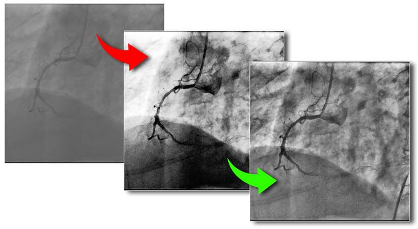

# Willowbend DICOM
A dialog-based DICOM to video converter.

***Chuan Yang*** (<yangc@sj-hospital.org>)

[](https://github.com/YangChuan80/WillowbendDICOM)
[](LICENSE)
[](https://github.com/YangChuan80/WillowbendDICOM/raw/master/Installer/WillowbendDICOM_Installer.exe?raw=true)
[](README.md)
[](README.md)
[](https://github.com/YangChuan80)

## Introduction
**DICOM (Digital Imaging and Communications in Medicine)** is a standard for handling, storing, printing, and transmitting information in medical imaging. DICOM files can be exchanged between two entities that are capable of receiving image and patient data in DICOM format by following network communications protocol. DICOM has been widely adopted by hospitals and is making inroads in smaller applications like dentists' and doctors' offices.

**Willowbend DICOM** is a dialog-based application performing the conversion from DICOM format to video format (avi) in order to meet the needs and requirements for universal computer systems (PC, Mac, Linux, etc.). So the ordinary users of such systems can use the converted file to present, communicate and store the universal files. 

Medical imaging related staffs (including Interventional Cardiologists, Physicians of Peripheral Intervention, Neurointerventional Physicians, Medical Imaging Physicians and Radiological Technicians) can use it in medical conferences, educations and remote consultants of clinical medicine, and they will feel free to use universal video formats in the slide presentations in medical courses and case reports. 

Furthermore, besides efficiently converting a file from DICOM to AVI format, Willowbend DICOM can implement **auto grey-scale optimization** and customization for every frame in a DICOM before conversion, and it's able to extract patient's information rapidly from the DICOM files. 
[](README.md)

## Installation from Binaries
- Download **[WillowbendDICOM_Installer.exe](https://github.com/YangChuan80/WillowbendDICOM/raw/master/Installer/WillowbendDICOM_Installer.exe?raw=true)** file from **[here](https://github.com/YangChuan80/WillowbendDICOM/raw/master/Installer/WillowbendDICOM_Installer.exe?raw=true)**, which is a NSIS installation file only used in Windows platform. 
- After downloading, you can install it directly. When finished, a folder with the same name have been made. Enter the folder WillowbendDICOM, run the **WillowbendDICOM.EXE** to go!
- This option is for ordinary users, who are not required to possess any knowledge of Python programming language or to have Python interpreter configured on their computers.
- Willowbend DICOM can currently be installed on Windows 7 or later platform only.

## Installation from Source
This option is only adopted by Python specialist. There are several dependencies necessarily preinstalled in your Python interpreter:

- **SimpleITK**
```
 conda install --channel https://conda.anaconda.org/SimpleITK SimpleITK
 ```

- **Pydicom** 1.0
 - Download pydicom source from [https://github.com/darcymason/pydicom](https://github.com/darcymason/pydicom)

- **OpenCV**
 - Download the wheel file from [https://scivision.co/install-opencv-3-0-x-for-python-on-windows/](https://scivision.co/install-opencv-3-0-x-for-python-on-windows/)

After you complete the WillowbendDICOM.py file download, run it:
```
python WillowbendDICOM.py
```
Python interpreter have to be Python 3.4 or later.

- **Setuptools & Pyinstaler**
 - If you'd like to use **PyInstaller**, you should downgrade your **setuptools** module to **19.2**.

To perform frozen binary, do this:
```
pyinstaller WillowbendDICOM.py -w
```

## Instructions
- Click **Browse** button to choose the DICOM file. 
- Load this chosen file. Don't forget to press **Load** button. When file successfully loaded, a information dialog will pop up to notice you. 
- Click **Convert** button on the right to convert the currently loaded DICOM file to AVI file. During this session, you will be asked to specify the location you're going to output to. Next you are required to select the VIDEO COMPRESSION options, which the **"Full Frames (Uncompressed)"** is recommended. Click **OK**. You'll wait for about a second, and your AVI file is ready! Congratulations!
- Optionally, you can customize the value of the **Clip Limit** if you're not satisfied with your converted AVI file with the default value of 3.0. The higher value means the more contrast effect in the video file you'll get. 

## License
The MIT License (MIT)
Copyright (c) 2016, Chuan Yang
All rights reserved.

Redistribution and use in source and binary forms, with or without
modification, are permitted provided that the following conditions are met:

* Redistributions of source code must retain the above copyright notice, this
  list of conditions and the following disclaimer.

* Redistributions in binary form must reproduce the above copyright notice,
  this list of conditions and the following disclaimer in the documentation
  and/or other materials provided with the distribution.

THIS SOFTWARE IS PROVIDED BY THE COPYRIGHT HOLDERS AND CONTRIBUTORS "AS IS"
AND ANY EXPRESS OR IMPLIED WARRANTIES, INCLUDING, BUT NOT LIMITED TO, THE
IMPLIED WARRANTIES OF MERCHANTABILITY AND FITNESS FOR A PARTICULAR PURPOSE ARE
DISCLAIMED. IN NO EVENT SHALL THE COPYRIGHT HOLDER OR CONTRIBUTORS BE LIABLE
FOR ANY DIRECT, INDIRECT, INCIDENTAL, SPECIAL, EXEMPLARY, OR CONSEQUENTIAL
DAMAGES (INCLUDING, BUT NOT LIMITED TO, PROCUREMENT OF SUBSTITUTE GOODS OR
SERVICES; LOSS OF USE, DATA, OR PROFITS; OR BUSINESS INTERRUPTION) HOWEVER
CAUSED AND ON ANY THEORY OF LIABILITY, WHETHER IN CONTRACT, STRICT LIABILITY,
OR TORT (INCLUDING NEGLIGENCE OR OTHERWISE) ARISING IN ANY WAY OUT OF THE USE
OF THIS SOFTWARE, EVEN IF ADVISED OF THE POSSIBILITY OF SUCH DAMAGE.

## Contributor List
- [@wenzhexue](http://github.com/wenzhexue) (**Wenzhe Xue**, Ph.D., Mayo Clinic) 
